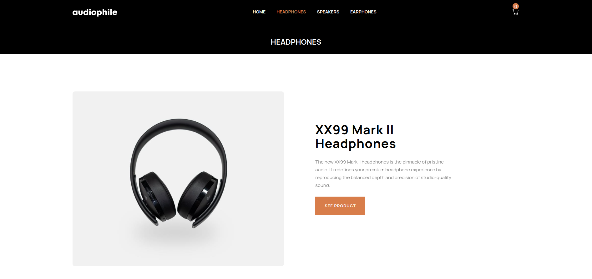
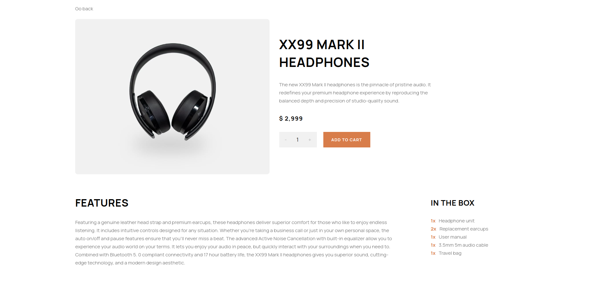
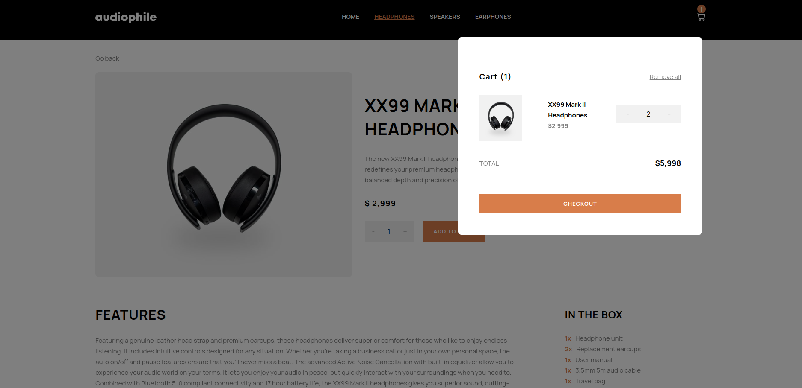
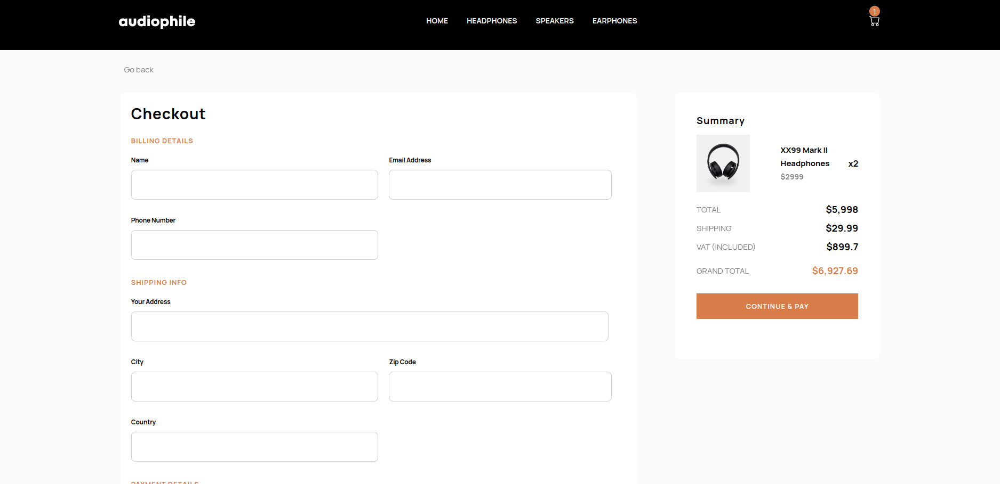
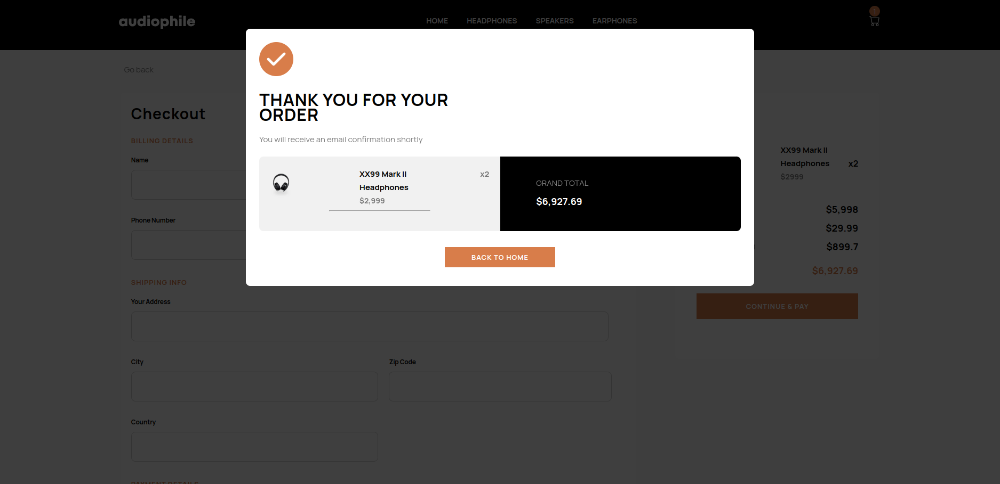

# Audiophile E-commerce Store

## Introduction

Welcome to the Audiophile e-commerce web store project. I completed this project as part of my training in the Azubi Africa Frontend Development program. The brief in this project was to build the user facing side of an e-commerce store that sells audio equipment. We were tasked with building the frontend of this project according to the specifications given in a Figma design file.

The project has been deployed on Vercel [here](https://audiophile-ecommerce-project-delta.vercel.app/)

### Technologies Used

### Major features of the project

The project incoporates multiple pages. There a individual product pages that a user can browse to find either headphones, speakers or earphones. The image below shows the product page for headphones.

The user can use the header menu to navigate between the individual pages. The header uses active link styling to let the user know what page they are on. 

In addition to the features above the application allows users to get a detailed view of any product they may be interested in. It is on this page that the user is able to first interact with the cart in the store.

The project also has a cart that users can interact with. The cart allows users to keep track of all products they have ordered from the store.

When the user clicks the "checkout" button in the cart they are taken to the checkout page below which has a form that allows users to enter their information.

Once the user has clicked the "continue and pay? button a modal confirming their order pops up from where they can return to the homepage.

